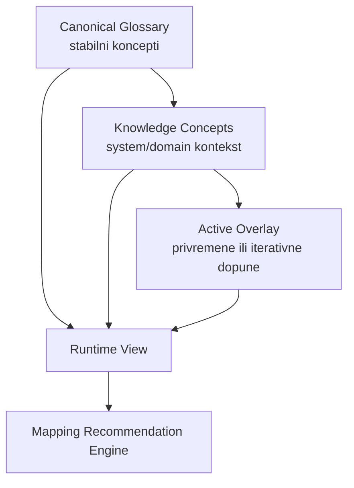

**Mentalni Model**
- Canonical je stabilni poslovni jezik: šta je “ispravan” biznis pojam.
- Knowledge je operativni prevod: kako se taj pojam pojavljuje po sistemima, domenima i realnim nazivima kolona.
- Overlay je kontrolisana dopuna/patch bez menjanja baze: brzo dodavanje aliasa i konteksta.
- Runtime je aktivna kompozicija onoga što mapping engine stvarno koristi u datom trenutku.

**Hijerarhija (od stabilnog ka promenljivom)**

**Ko je “iznad” koga**
- Canonical ima najviši semantički autoritet.
- Knowledge mapira vendor/system realnost na canonical.
- Overlay ima prioritet u runtime-u nad baznim knowledge unosima, ali je governance-kontrolisan.
- Runtime je “effective state”, ne zaseban izvor istine.

**Kada se šta uzima u obzir u preporukama**
- U candidate fazi: naziv kolone, semantika, tip, pattern, statistika, plus knowledge/canonical signali.
- U ranking fazi: knowledge i canonical ulaze kao dodatni signali u final score.
- U explainability fazi: vidi se da li je pogodak došao preko canonical/knowledge traga.
- U canonical-only modu: target je virtualan, pa canonical signal ima još veću težinu za smislenost preporuke.
- Ako canonical putanja nije dovoljna: ulazi Canonical Gap tok (predlog novog koncepta/aliasa).

**Praktična pravila korišćenja**
- Canonical koristiš kad želiš stabilan, sistemski-neutralan model.
- Knowledge koristiš kad znaš da sistemi imaju “lokalne” nazive i sinonime.
- Overlay koristiš za brzu, kontrolisanu iteraciju bez trajnog menjanja baze.
- Runtime proveravaš kad želiš da potvrdiš šta je trenutno aktivno tokom mapiranja.

**Tipični slučajevi u procesu preporuka**
- Case 1: Direktan canonical pogodak.
- Case 2: Pogodak preko knowledge aliasa iz istog source sistema.
- Case 3: Pogodak tek nakon overlay aliasa koji zatvara “gap”.
- Case 4: Nema dobrog canonical traga -> needs_review + gap suggestion.
- Case 5: Više kandidata slično dobrih -> ostaje analyst decision, ne auto-apply.

**Kako izgleda životni ciklus (operativno)**
- Novi signal prvo ide u Overlay.
- Validacija i stewardship (approve/reject/ignore).
- Ako je stabilno i ponovljivo korisno, promoviše se u canonical/glossary.
- Runtime se osveži i novi signal odmah utiče na naredne preporuke.

**Brzi “decision playbook”**
- Ako problem pogađa jedan sistem ili jedan rollout: Overlay.
- Ako je termin poslovno univerzalan i trajan: Canonical.
- Ako je vendor-specifično mapiranje, sinonim ili tehnički naziv: Knowledge.
- Ako rezultat u UI deluje nelogično: prvo proveri Runtime/active overlay, pa tek onda engine tuning.